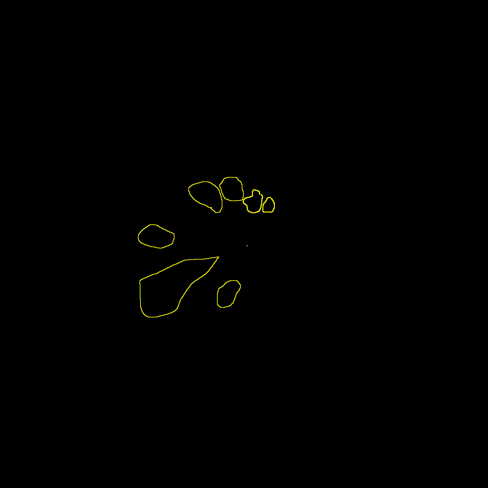
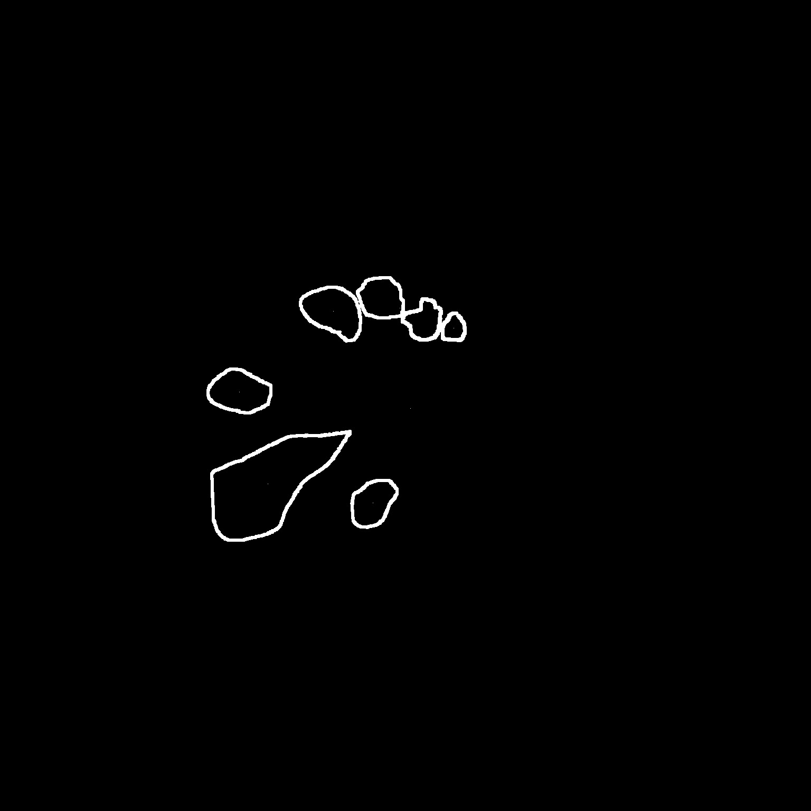
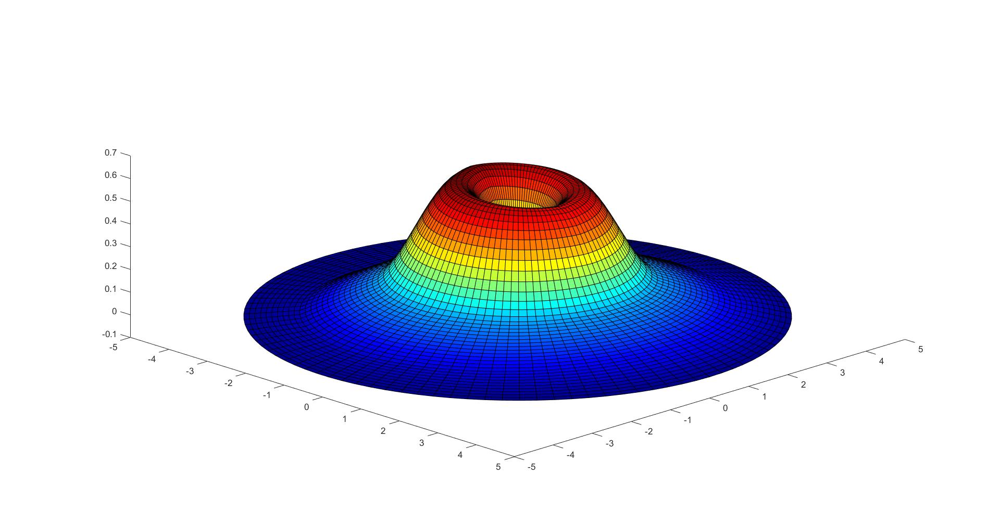
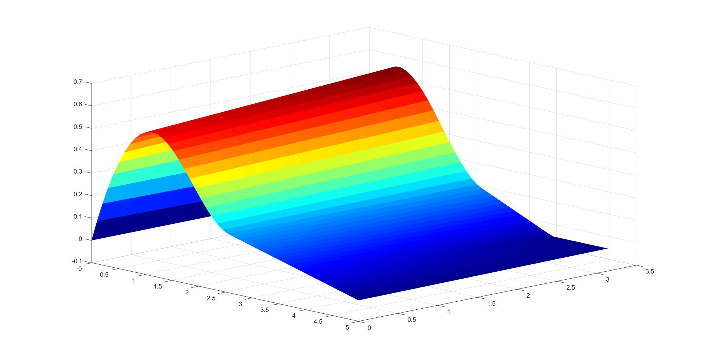

# Deep-Capillary-Plexus-Features-in-AMN

Reads AMN lesion masks, calculates centroid and performes the displacement for each mask boarder and centroids, to correct for HFL length and orientation. 
HFL length and orientation were calculated along the horizontal meridian for each point of the segmented region, according to GCL lateral displacement coefficients in [1]. Displacement values for any other meridians was obtained by a linear interpolation between values of the horizontal meridian within the same distance from the foveal center in a polar coordinate system. 

Masks must have the following name format: "<Name>_<Eye(OS or OD)>_MASK.tif" or "<Name>_<Eye(OS or OD)>_mask.tif" 
Hard Coded for images with size 1536 with resolution of 0.0053086597472429276 or size 768 with resolution of 0.01110921148210764
  
Disclamer: Script can be further optimized both in time and precision!
  
[1]: Drasdo N, Millican CL, Katholi CR, Curcio CA. The length of Henle fibers in the human retina and a model of ganglion receptive field density in the visual field. Vision Research. 2007;47(22):2901-2911. doi:10.1016/j.visres.2007.01.007  
  
# Images:
(Upper Left): Example Input; (Upper Right): Example Output; (Lower Left): 3D Projection of the Displacement of HFL in a cartesian coordinate system;
(Lower Right): 3D Projection of the Displacement of HFL in a polar coordinate system
  

  
